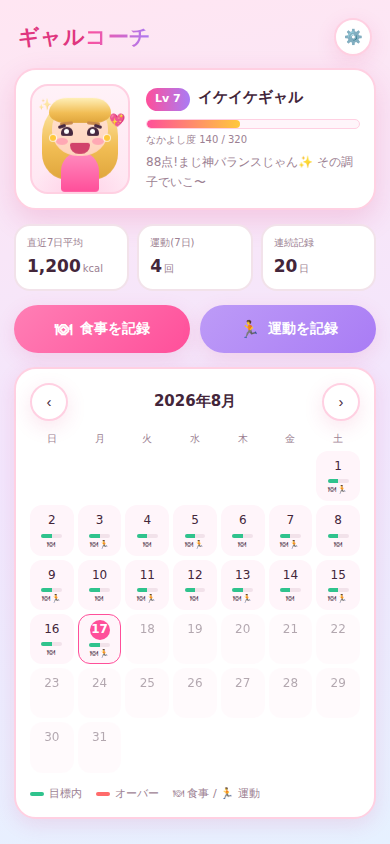
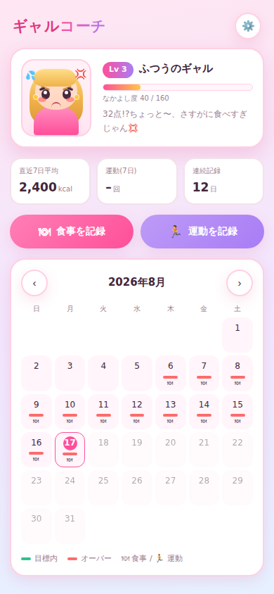
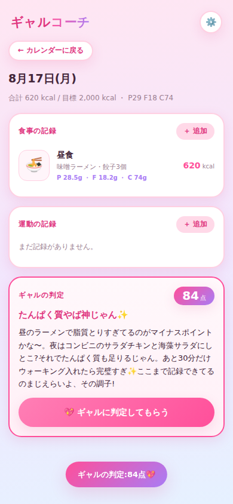

# ギャルコーチ 💖

食事のPFC(たんぱく質・脂質・炭水化物)とカロリーを記録すると、**ギャルのコーチが100点満点で採点して、
ギャル語でアドバイスをくれる**アプリ。点数に応じてギャルの表情が変わり、食生活が乱れると体型にも出る。

**AIを3つの異なる形で実務的に組み込んだ、個人開発のWebアプリ**です。

---

## スクリーンショット

| 好調なとき | 食べすぎが続くと | ギャルの判定 |
|---|---|---|
|  |  |  |
| ご機嫌でスリム | 怒ってぽっちゃり | 点数+ギャル語アドバイス |

---

## 何ができるか

- **カレンダー記録** — 食事(写真つき)と運動を日付ごとに記録。localStorage + IndexedDB で端末内に保存
- **AIカロリー/PFC推定** — 食べたものを書くか写真を撮ると、カロリーとP/F/Cが自動入力
- **ギャルの採点** — その日のPFCバランスを0〜100点で採点し、点数の理由・今日の残りの食事プラン・運動プランをギャル語で提案
- **キャラのリアクション** — 点数でギャルの表情が変わる(80点以上=ご機嫌✨ / 60点台=にっこり / 40点台=心配🥺 / 40点未満=お怒り💢)。
  直近7日の食生活が乱れると体型もぽっちゃりに、節制+運動が続くとスリムになる
- **なかよし度(レベル)** — 記録するほどギャルと仲良くなり、Lv3でピアス、Lv6で髪色チェンジ、Lv10でティアラ👑、Lv15で伝説のギャルに
- **AI精度のフィードバックループ** — ユーザーがAI推定を手直しすると差分を実測データとして蓄積。次回の推定にfew-shot例として渡し、その人の「一人前」に合わせていく

---

## AI設計のポイント(この開発で意図したこと)

「APIを1回叩いた」で終わらせず、**AIプロダクトとして必要な要素**を意識して組み込んだ。

### 1. 用途に応じて3つのAI機能を使い分け

| 機能 | 使ったAIの技術 | なぜ |
|---|---|---|
| カロリー/PFC推定 | **構造化出力**(JSON Schemaで応答を固定) | 数値を確実にフォームへ流し込むため。自由文だと壊れる |
| 写真からの推定 | **マルチモーダル(画像入力)** | 「写真を撮るだけ」の低摩擦な入力体験を実現 |
| ギャルの採点・助言 | **構造化出力 + キャラクター設定** | `{score, headline, advice}` で受け取り、点数はUI(表情・バッジ)に、文章は表示に使い分ける。口調はシステムプロンプトで制御しつつ、栄養面の正確さは担保 |

キャラクター性(ギャル語・絵文字)と、数値の機械的な扱いやすさを**同時に成立させる**のがこの設計の肝。
点数を自由文から正規表現で抜くのではなく、スキーマで型付きに受け取ることで、表情の出し分けが安定する。

### 2. APIキーを絶対にフロントに置かない(セキュリティ)

静的Webアプリから直接Claude APIを呼ぶと、キーが誰でも見える状態になり悪用される。
そのため **Cloudflare Workers に中継サーバー(プロキシ)を1本立て、キーはサーバー側のSecretにのみ保管**する構成にした。

```
[スマホ/ブラウザ]  →  [Cloudflare Worker (中継)]  →  [Claude API]
  アプリ本体            APIキーはここだけに保管        推論
  (GitHub Pages)        + アクセストークンで保護
```

### 3. コストを意識したモデル選定

- モデルは1行の定数で切り替え可能に設計(`worker/worker.js` の `MODEL`)
- 短い推定・採点には軽量な **Haiku** を採用し、コストを Sonnet の約1/3 に
- 推定・採点は `thinking: disabled` にして無駄な思考トークンを抑制

### 4. AIの精度を測り、改善する仕組み

- ユーザーがAI推定を手直しした差分を蓄積し、**平均誤差(±%)を可視化**
- 蓄積した実測値を次回の推定に **few-shot例** として渡し、その人の一人前の感覚に寄せる
- 「AIの出力を鵜呑みにせず、計測してループを回す」というAIプロダクトの基本を実装で示した

### 5. バックエンド未設定でも動く(段階的移行)

AI連携を設定していない状態でも、プロンプトを生成してコピーする「手動モード」で機能する
(貼り付けたコメントから「78点」のような表記を拾ってキャラに反映する)。
0円で始めて、必要になったらAPI化する——という現実的な移行パスを設計に組み込んだ。

---

## 技術構成

- **フロント**: 依存ライブラリなしの HTML / CSS / JavaScript(ビルド不要)。キャラクターもCSSのみで描画
- **保存**: localStorage(記録・設定・補正履歴)+ IndexedDB(写真)
- **バックエンド**: Cloudflare Workers(依存なしの単一ファイル、`fetch` で Claude API を呼ぶプロキシ)
- **AI**: Anthropic Claude API(構造化出力 / 画像入力 / システムプロンプト)
- **ホスティング**: GitHub Pages(フロント)+ Cloudflare(バックエンド)、いずれも無料枠

---

## ディレクトリ

```
.
├── index.html        # 画面
├── style.css         # ギャル系テーマ + キャラクター描画
├── app.js            # 記録・カレンダー・なかよし度・表情/体型・フィードバック
├── api.js            # 中継サーバー呼び出し
├── worker/           # 中継サーバー(Cloudflare Worker)
│   ├── worker.js     # Claude API プロキシ(PFC推定・ギャル採点)
│   ├── wrangler.toml
│   └── README.md     # デプロイ手順
├── IDEAS.md          # 構想・ロードマップ
└── alarm/            # (別アプリ)最初に作ったアラーム
```

---

## セットアップ

### アプリだけ動かす(AI連携なし・0円)

`index.html` をブラウザで開くだけ。記録・カレンダー・なかよし度・プロンプト生成が使える。

### AI連携を有効にする

1. Anthropic APIキーを取得(console.anthropic.com)
2. `worker/README.md` の手順で Cloudflare Worker をデプロイ
3. アプリの ⚙️ 設定に、Workerの URL とアクセストークンを入力

---

## 開発の進め方(フェーズ)

1. ✅ **フェーズ1**: API無しMVP(カレンダー・記録・キャラ育成・プロンプト生成)
2. ✅ **フェーズ2**: AI連携のAPI化(Cloudflare Worker 経由)
3. ✅ **フェーズ3**: 写真/テキストからのPFC自動推定 + 精度フィードバック
4. ✅ **フェーズ4**: ギャルコーチ化(点数評価・キャラリアクション)
5. ⬜ **フェーズ5(構想)**: 複数人で競うチーム機能(サーバー+アカウント導入)

詳細は `IDEAS.md` を参照。

---

## 品質確認

主要フロー(記録→カレンダー反映→AI推定→手直し記録→ギャル判定→表情反映→永続化)は
ヘッドレスブラウザ(Playwright)による自動テストで検証している。
